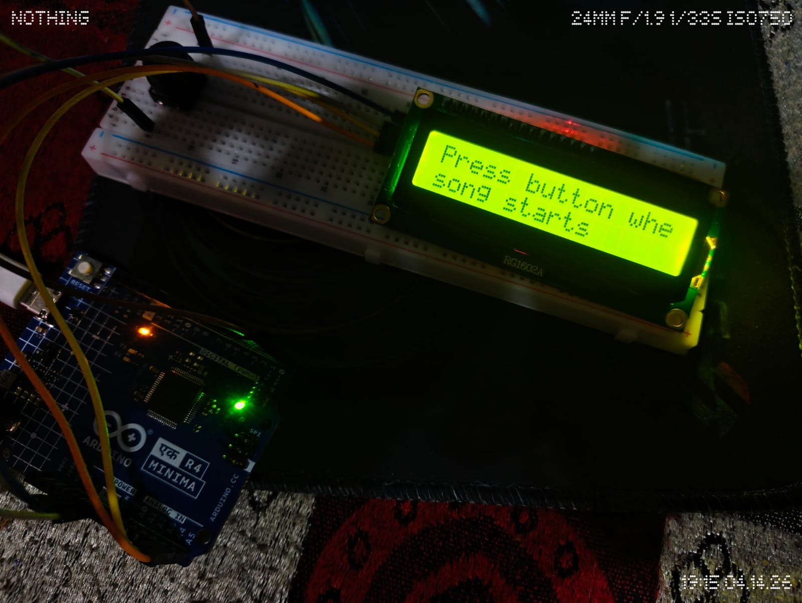
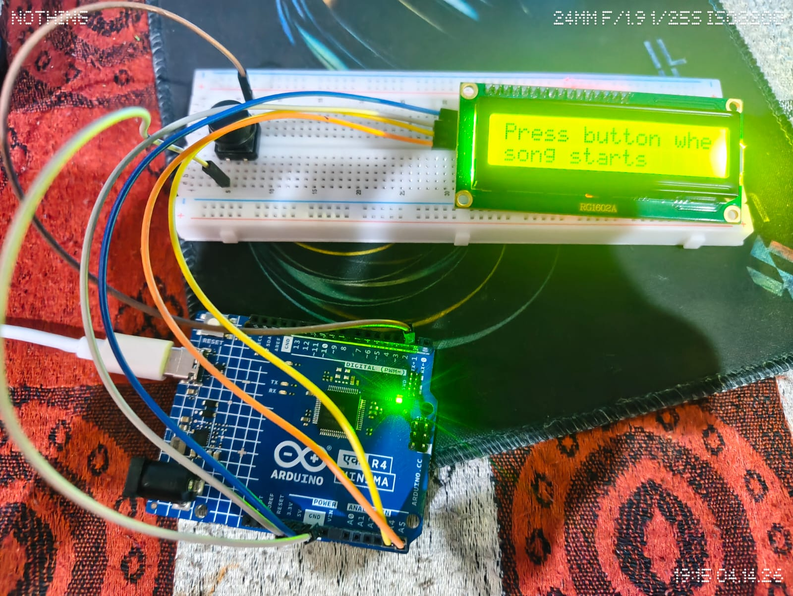
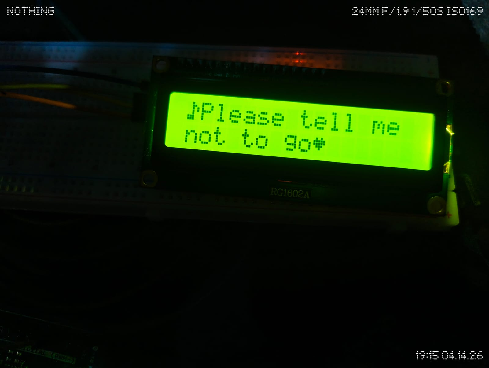

# 🎵 Arduino LCD Lyric Display

A synchronized lyric display built using Arduino and a 20x4 I2C LCD, timed to match a song.

## 🚀 Features
- Real-time lyric synchronization
- Custom characters (heart ❤️, music note 🎵)
- Smooth transitions using Arduino timing
- Visual demo included

## 🛠️ Tech Used
- Arduino UNO R4
- I2C LCD (20x4)
- C++ (Arduino)

## 📸 Setup




## 🎥 Demo
▶ See demo.mp4 for working video

## 💡 Idea
This project explores syncing hardware output with real-time audio timing, turning a basic LCD into a lyric display system.

## 🧩 Customize Your Own Lyrics

You can easily modify this project to display your own song lyrics.

### ✏️ Steps:

1. Open the `.ino` file  
2. Locate the `showLyric()` function calls inside `loop()`

Example: 
```cpp
showLyric("I live under", "your eyelids", 4500);
```

3. Replace the text with your own lyrics:
```cpp
showLyric("Your line 1", "Your line 2", delay_time);
```

4. Adjust the timing (delay_time) in milliseconds to match your song:
- 1000 ms = 1 second  
- Sync the timing with the song for best results
5. 💡 Tips:
- Keep each line within 16–20 characters (LCD limit)
- Split long lyrics into multiple screens
- Use trial and error to get perfect timing
- Start the song right when Arduino resets for better sync

6. 🎵 Custom Icons
   You can also use:
-lcd.write(byte(0));  → ❤️ (heart)
-lcd.write(byte(1));  → 🎵 (music note)
